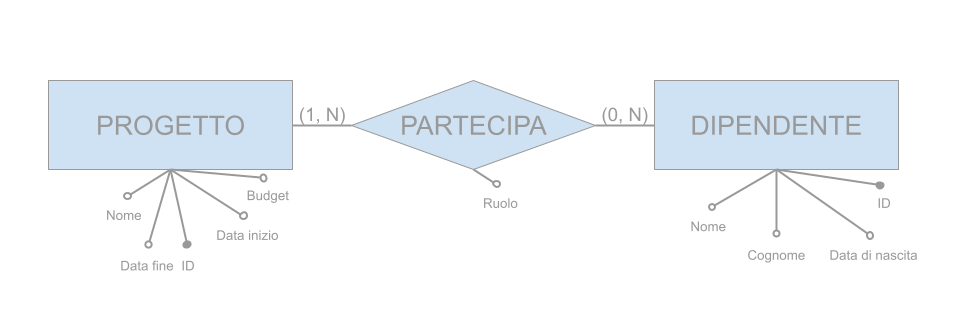
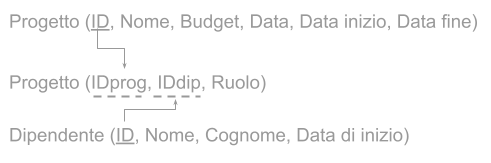

# Correzione verifica 1
1. 
2. 
3. Scrivere le istruzioni SQL per creare le tabelle desunte dal modello logico
    ```sql
    CREATE TABLE Progetto (
      ID int IDENTITY(0, 1) PRIMARY KEY,
      Nome varchar(100),
      DataInizio date,
      DataFine date,
      Budget decimal(8, 2)
    );

    CREATE TABLE Dipendente (
      ID int IDENTITY(0, 1) PRIMARY KEY,
      Nome varchar(50),
      Cognome varchar(50),
      DataDiNascita date,
    );

    CREATE TABLE Partecipazione (
      IDprog int FOREIGN KEY REFERENCES Progetto(ID),
      IDdip int FOREIGN KEY REFERENCES Dipendente(ID),
      Ruolo varchar(50)
    );
    ```

4. Scrivere le istruzioni SQL necessarie per inserire il progetto “Esselunga”, il dipendente “Bosoni Stefano” e il fatto che Bosoni Stefano lavora sul progetto Esselunga (vedi informazioni presenti nelle tabelle soprastanti)
    ```sql
    INSERT INTO Progetto (Nome, DataInizio, Budget)VALUES ('Esselunga', '2020-03-17', 100000.00);

    INSERT INTO Dipendente (Nome, Cognome) VALUES ('Stefano', 'Bosoni');

    INSERT INTO Partecipazione (IDprog, Iddip, ruolo) VALUES (0,0,'analista programmatore');
    ```


5. Scrivere le istruzioni SQL per aggiungere anche la data di assunzione del dipendente.
    ```sql
    ALTER TABLE Dipendente ADD DataDiAssunzione date;
    ```

6. Scrivere le istruzioni SQL per memorizzare il fatto che Bosoni Stefano è stato assunto il 9 agosto del 1990.
    ```sql
    UPDATE Dipendente SET DataDiAssunzione= '1990-08-09' WHERE ID= 0;
    ```

7. Scrivere le istruzioni SQL per cambiare il nome del progetto da “Esselunga” a ”Esselunga – viale Suzzani”
    ```sql
    UPDATE Progetto SET Nome= 'Esselunga - Viale suzzani' WHERE ID= 0;
    ```

8. Scrivere le istruzioni SQL per aumentare del 10% il budget del progetto di ”Esselunga – viale Suzzani”
    ```sql
    UPDATE Progetto SET Budget= Budget * 1.1 WHERE ID= 0;
    ```

9. Scrivere le istruzioni SQL per eliminare dal database tutti i dati del progetto Deutsche Bank
    ```sql
    -- Suppondendo che il progetto "Deutsche Bank" corripsonda all'ID 1 
    DELETE FROM Partecipazione WHERE IDprog= 1;

    DELETE FROM Progetto WHERE ID= 1;
    ```