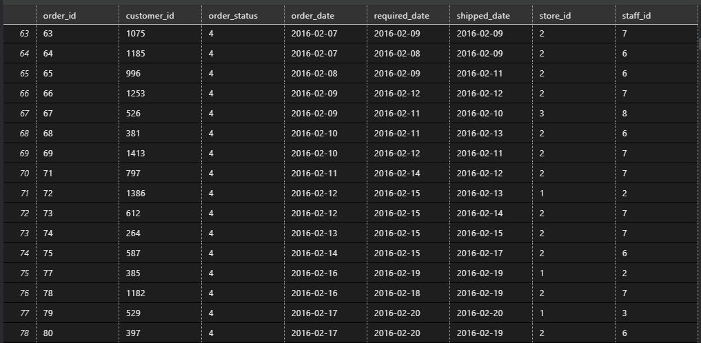
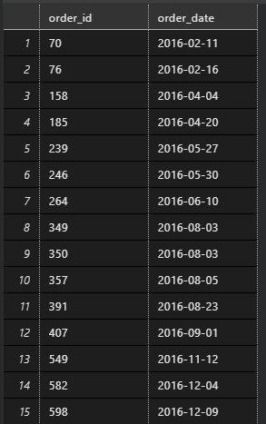
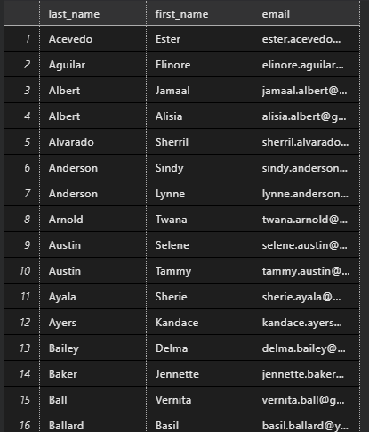
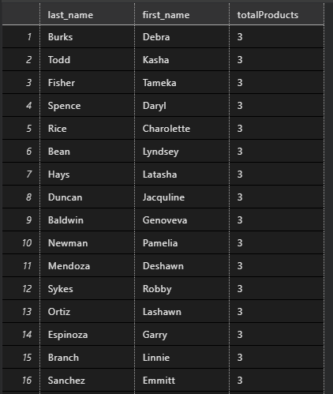
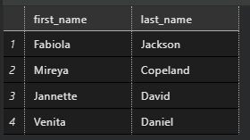

# Correzione verifica 2


1. I nominativi dei clienti che hanno una email di gmail
    ```sql
    SELECT sales.customers.last_name, sales.customers.first_name FROM sales.customers
    WHERE sales.customers.email LIKE '%@gmail.com'
    ```
    
2. Il nome e il cognome dei clienti che non abitano a New York
    ```sql
    SELECT sales.customers.first_name, sales.customers.last_name FROM sales.customers
    WHERE sales.customers.city <> 'New York'
    ```
    
3. Lo sconto piu' alto effettuato su un prodotto
    ```sql
    SELECT MAX(sales.order_items.discount)*100 FROM sales.order_items
    ```
    
4. Gli ordini che sono stati gia' consegnetia
    ```sql
    SELECT * FROM sales.orders
    WHERE sales.orders.shipped_date IS NOT NULL
    ```
    
5. Gli ordini che non sono ancora stati spediti. Visualizzare l'ID e la data in cui e' stato effettuato l'ordine
    ```sql
    SELECT sales.orders.order_id, sales.orders.order_date FROM sales.orders
    WHERE sales.orders.shipped_date IS NULL
    ```
    
6. I prodotti aquistati dal client Martin Spencer
    ```sql
    SELECT * FROM production.products
    INNER JOIN sales.order_items
    ON production.products.product_id = sales.order_items.product_id
    INNER JOIN sales.orders
    ON sales.order_items.order_id = sales.orders.order_id
    INNER JOIN sales.customers
    ON sales.customers.customer_id = sales.orders.customer_id
    WHERE sales.customers.last_name = 'Martin'
    AND sales.customers.first_name = 'Spanecer' 
    ```
7. I nominativi e le email dei clienti che abitano in California e in Texas. Ordinare il risultato sul cognome del cliente in ordine alfabetico
    ```sql
    SELECT sales.customers.last_name, sales.customers.first_name, sales.customers.email FROM sales.customers
    WHERE sales.customers.state = 'CA'
    OR sales.customers.state = 'TX'
    ORDER BY sales.customers.last_name
    ```
    
8. Il numero di ordini per ogni cliente. Visualizare il cognome e il nome del cliente e il numero dei suoi ordini. Ordinare in Ordinare decrescente sul numero di ordini
    ```sql
    SELECT sales.customers.last_name, sales.customers.first_name, COUNT(*) AS totalProducts
    FROM sales.customers
    INNER JOIN sales.orders 
    ON sales.customers.customer_id = sales.orders.customer_id
    GROUP BY sales.orders.customer_id, sales.customers.last_name, sales.customers.first_name
    ORDER BY totalProducts DESC;
    ```
    
9.  Il numero di dipendenti per ogni store
    ```sql
    SELECT sales.stores.store_name, COUNT(*) as totalStaff FROM sales.stores
    INNER JOIN sales.staffs
    ON sales.stores.store_id = sales.staffs.store_id
    GROUP BY sales.stores.store_name
    ```
    
10. Il nome e il cognome dei clienti che hanno effettuato piu' di 50 ordini
    ```sql
    SELECT sales.customers.last_name, sales.customers.first_name, COUNT(*) AS totalProducts
    FROM sales.customers
    INNER JOIN sales.orders 
    ON sales.customers.customer_id = sales.orders.customer_id
    GROUP BY sales.orders.customer_id, sales.customers.last_name, sales.customers.first_name
    HAVING totalProducts > 50
    ```
11. Il nome dello store con piu' dipendenti
    ```sql
    SELECT sales.stores.store_name
    FROM sales.stores
    INNER JOIN sales.staffs
    ON sales.staffs.store_id = sales.stores.store_id

    GROUP BY sales.stores.store_name

    HAVING COUNT(*) = (
      SELECT MAX(newTable.totalProducs)
      FROM (SELECT sales.stores.store_name, COUNT(*) AS totalProducs
        FROM sales.stores
        INNER JOIN sales.staffs
        ON sales.staffs.store_id = sales.stores.store_id

        GROUP BY sales.stores.store_name ) newTable
    )
    ```
    
12. Il nome e il cognome dei manager
    ```sql
    SELECT sales.staffs.first_name, sales.staffs.last_name FROM sales.staffs
    WHERE sales.staffs.staff_id IN (
        SELECT sales.staffs.manager_id FROM sales.staffs
    )
    ```
    