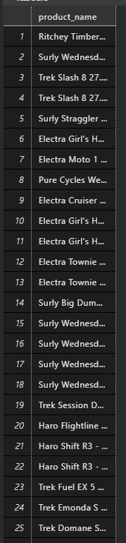

# Bikes Stores
:link: [Riferimento](https://www.sqlservertutorial.net/sql-server-sample-database/)

## Modello ER


## Modello Logico


1. I nomi dei brand
    ```sql
    SELECT production.products.brand_name FROM production.brands;
    ```
    

2. I nomi dei prodotti con il brand
    ```sql
    SELECT production.products.product_name, production.brands.brand_name FROM production.products
    INNER JOIN production.brands
    ON production.brands.brand_id = production.products.brand_id;
    ```
    

3. I nomi dei prodotti con il brand e la categoria a cui appartiene il prodotto
    ```sql
    SELECT production.products.product_name, production.brands.brand_name, production.categories.category_name FROM production.products
    INNER JOIN production.brands
    ON production.brands.brand_id = production.products.brand_id
    INNER JOIN production.categories
    ON production.products.category_id = production.products.category_id;
    ```
    

4. I nomi dei prodotti con le quantità disponibili in stock
    ```sql
    SELECT production.products.product_name, production.stocks.quantity FROM production.products
    INNER JOIN production.stocks
    ON production.products.product_id = production.stocks.product_id
    ```
    

5. I nomi dei prodotti che hanno uno stock superiore a 10
    ```sql
    SELECT production.products.product_name FROM production.products
    INNER JOIN production.stocks
    ON production.products.product_id = production.stocks.product_id
    WHERE production.stocks.quantity > 10
    ```
    

6. I nomi dei prodotti che hanno uno stock compreso tra 5 e 10
    ```sql
    SELECT production.products.product_name FROM production.products
    INNER JOIN production.stocks
    ON production.products.product_id = production.stocks.product_id
    WHERE production.stocks.quantity BETWEEN 5 AND 10
    ```
    

7. I nomi dei prodotti che hanno uno stock compreso tra 5 e 10 e cje costano meno di 300 $
    ```sql
    SELECT production.products.product_name FROM production.products
    INNER JOIN production.stocks
    ON production.products.product_id = production.stocks.product_id
    WHERE production.stocks.quantity BETWEEN 5 AND 10
    AND production.products.list_price < 300
    ```
    

8. I nomi dei prodotti che hanno la parola "Cruiser" nel nome
    ```sql
    SELECT production.products.product_name FROM production.products
    WHERE production.products.product_name LIKE '%Cruiser%'
    ```
    

9. I nomi dei prodotti che non hanno la parola "Cruiser" nel nome
    ```sql
    SELECT production.products.product_name FROM production.products
    WHERE production.products.product_name NOT LIKE '%Cruiser%'
    ```
    