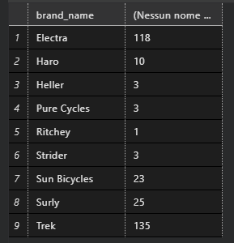
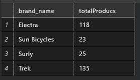
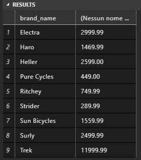
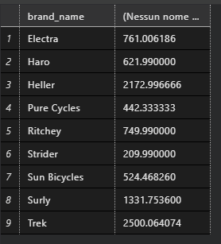
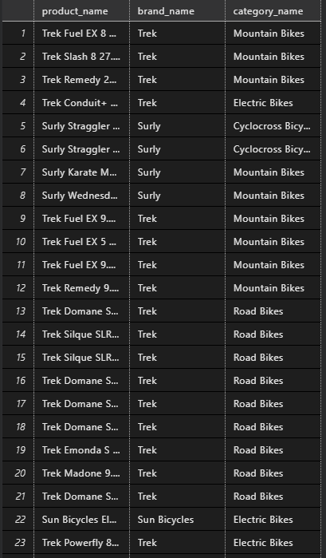
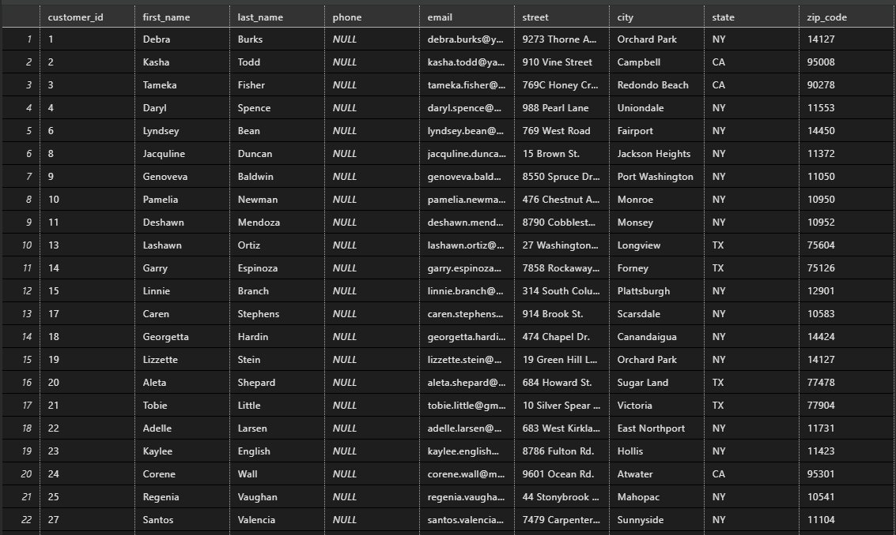

# Bikes Stores
:link: [Riferimento](https://www.sqlservertutorial.net/sql-server-sample-database/)

1. Il numero di prodotti per ogni brand
    ```sql
    SELECT production.brands.brand_name, COUNT(*) AS totalProducs FROM production.brands
    INNER JOIN production.products
    ON production.products.brand_id = production.brands.brand_id
    GROUP BY production.brands.brand_name;
    ```
    

2. I brand che hanno più di 10 prodotti
    ```sql
    SELECT production.brands.brand_name, COUNT(*) as totalProducs FROM production.brands
    INNER JOIN production.products
    ON production.products.brand_id = production.brands.brand_id
    GROUP BY production.brands.brand_name
    HAVING COUNT(*) > 10;
    ```
    

3. Il prezzo massimo dei prodotti di ogni brand
    ```sql
    SELECT production.brands.brand_name, MAX(production.products.list_price) FROM production.brands
    INNER JOIN production.products
    ON production.products.brand_id = production.brands.brand_id
    GROUP BY production.brands.brand_name
    ```
    

4. Il prezzo medio dei prodotti di ogni brand
    ```sql
    SELECT production.brands.brand_name, AVG(production.products.list_price) FROM production.brands
    INNER JOIN production.products
    ON production.products.brand_id = production.brands.brand_id
    GROUP BY production.brands.brand_name
    ```
    

5. Il brand del prodotto che costa di più
    ```sql
    SELECT production.brands.brand_name FROM production.brands
    INNER JOIN production.products
    ON production.products.brand_id = production.brands.brand_id

    WHERE production.products.list_price = (SELECT MAX(production.products.list_price) FROM production.products)
    ```
    

6. La categoria del prodotto che costa di meno
    ```sql
    SELECT production.categories.category_name FROM production.categories
    INNER JOIN production.products
    ON production.products.category_id = production.categories.category_id
    WHERE production.products.list_price = (SELECT MIN(production.products.list_price) FROM production.products)
    ```
    

7. Il nome, il brand e la categoria dei prodotti che costano più della media
    ```sql
    SELECT production.products.product_name, production.brands.brand_name, production.categories.category_name
    FROM production.products
    INNER JOIN production.categories
    ON production.products.category_id = production.categories.category_id
    INNER JOIN production.brands
    ON production.products.brand_id = production.brands.brand_id
    WHERE production.products.list_price > (SELECT AVG(production.products.list_price) FROM production.products)
    ```
    

8. I clienti di cui non si conosce il numero di telefono
    ```sql
    SELECT * FROM sales.customers
    WHERE sales.customers.phone IS NULL
    ```
    

9. Il brand con più prodotti
    ```sql
    SELECT production.brands.brand_name
    FROM production.brands
    INNER JOIN production.products
    ON production.products.brand_id = production.brands.brand_id

    GROUP BY production.brands.brand_name

    HAVING COUNT(*) = (
      SELECT MAX(newTable.totalProducs)
      FROM (SELECT production.brands.brand_name, COUNT(*) AS totalProducs
        FROM production.brands
        INNER JOIN production.products
        ON production.products.brand_id = production.brands.brand_id

        GROUP BY production.brands.brand_name ) newTable
    )
    ```
    

* Clienti che non hanno comperato un certo prodotto (scegliere un prodotto)
    ```sql
    SELECT * FROM sales.customers
    WHERE sales.customers.customer_id NOT IN (
      SELECT sales.customers.customer_id FROM sales.order_items
      INNER JOIN sales.orders
      ON sales.orders.order_id = sales.order_items.order_id
      INNER JOIN production.products
      ON production.products.product_id = sales.order_items.product_id
      INNER JOIN sales.customers
      ON sales.orders.customer_id = sales.customers.customer_id
      WHERE sales.order_items.product_id = 17
    )
    ```