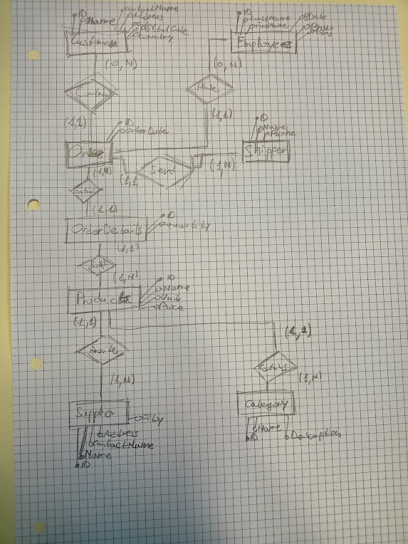

# Reverse engineering
## Modello logico
Il modello logico prende come riferimento questo [database](https://www.w3schools.com/sql/trysql.asp?filename=trysql_select_all).

Customers(**ID**, CustomerName, ContactName, Address, City, PostalCode, Country)<br>
Employees(**ID**, LastName, FirstName, BirthDate, Photo, Notes)<br>
Shippers(**ID**, Name, Phone)<br>
Orders(**ID**, *CustomerID*, *EmployeeID*, OrderDate, *ShipperID*)<br>
OrderDetails(**ID**, *OrderID*, *ProducID*, Quantity)<br>
Products(**ID**, Name, *SupplierID*, *CategoryID*, Unit, Price)<br>
Categories(**ID**, Name, Description)<br>
Suppliers(**ID**, Name, ContactName, Address, City)

## Modello E/R


## Query
1. Tutte le informazioni sui clienti
    ```sql
    SELECT * FROM Customers
    ```
2. Il nome e l'indirizzo di tutti i clienti
    ```sql
    SELECT CustomerName, Address FROM Customers
    ```
3. Il nome e l'indirizzo di tutti i clienti rinominando le colonne in italiano
    ```sql
    SELECT CustomerName as Nome, Address as Indirizzo FROM Customers
    ```
4. Il nome e l'indirizzo dei clienti tedeschi
    ```sql
    SELECT CustomerName, Address FROM Customers WHERE Country = 'Germany'
5. Il nome e l'indirizzo dei clienti tedeschi e francesi
    ```sql
    SELECT CustomerName, Address FROM Customers WHERE Country = 'Germany' OR Country = 'France'
    ```
6. Il nome e l'indirizzo dei clienti tedeschi, francesi, italiani, statunitensi e messicani
    ```sql
    SELECT CustomerName, Address
    FROM Customers
    WHERE Country = 'Germany' OR Country = 'France' OR Country = 'Italy' OR Country = 'USA' OR Country = 'Mexico'
    ```
     ```sql
    SELECT CustomerName, Address
    FROM Customers
    WHERE Country IN ('Germany', 'France', 'Italy', 'USA', 'Mexico')
    ```
7. Il numero di clienti per ogni nazione
    ```sql
    SELECT Country, COUNT(*) as Customers FROM Customers
    GROUP BY (Country)
    ```
8. Le nazioni in cui ci sono più di 10 clienti
    ```sql
    SELECT Country, COUNT(*) as Customers FROM Customers
    GROUP BY (Country)
    HAVING Customers > 10
    ``` 
9. Le nazioni con più clienti
    ```sql
    SELECT Country, MAX(C) as Customers FROM 
    (
    SELECT Country, COUNT(*) as C FROM Customers
    GROUP BY Country
    )
    ```

10. I dipendenti nati negli anni 50
    ```sql
    SELECT * FROM [Employees]
    WHERE BirthDate Between '1950-1-1' AND '1959-12-1'
    ```
11. I dipendenti nati in luglio
    ```sql
    SELECT * FROM [Employees]
    WHERE MONTH(BirthDate) = 7
    ```
12. I dipendenti nella cui descrizione appare la parola University
    ```sql
    SELECT * FROM [Employees]
    WHERE Notes LIKE '%University%'
    ```
13. I dipendenti nella cui descrizione non appare la parola University
    ```sql
    SELECT * FROM [Employees]
    WHERE Notes NOT LIKE '%University%'
    ```
14. I dipendenti che hanno una descrizione composta da tre frasi
    ```sql
    SELECT * FROM [Employees]
    WHERE Notes LIKE '%.%.%.'
    ```
15. Il dipendente più giovane
    ```sql
    SELECT * FROM [Employees]
    WHERE BirthDate = (SELECT MIN(BirthDate) FROM [Employees]) 
    ```

16. Il prezzo medio dei prodotti
    ```sql
    SELECT AVG(Price) as MinPrice FROM [Products]
    ```
17. Il prezzo del prodotto che costa di meno
    ```sql
    SELECT MIN(Price) as LowestPrice FROM [Products]
    ```
18. Il prodotto che costa di più
    ```sql
    SELECT * FROM [Products]
    WHERE Price = (SELECT MIN(Price) FROM Products)
    ```
19. Il prezzo del prodotto che costa di più
    ```sql
    SELECT * FROM [Products]
    WHERE Price = (SELECT MAX(Price) FROM Products)
    ```
20. Il prodotto che costa di meno
    ```sql
    SELECT * FROM [Products]
    WHERE Price = (SELECT MIN(Price) FROM Products)
    ```
21. I prodotti che costano più della media
    ```sql
    SELECT * FROM [Products]
    WHERE Price >= (SELECT AVG(Price) FROM Products)
    ```
22. Il numero di prodotti presenti nella tabella products
    ```sql
    SELECT COUNT(*) as Products FROM [Products]
    ```
23. Il numero di prodotti che costano più della media
    ```sql
    SELECT COUNT(*) FROM [Products]
    WHERE Price >= (SELECT AVG(Price) FROM Products)
    ```
24. I prodotti che costano tra i 10 e 20 dollari
    ```sql
    SELECT * FROM [Products]
    WHERE Price BETWEEN 10 AND 20
    ```