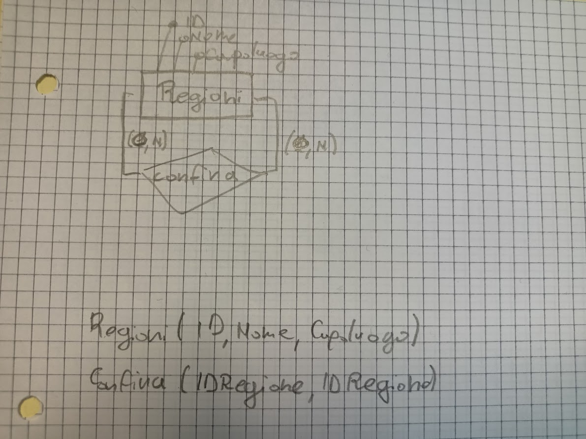

# Database regioni
Progettare un semplice database per memorizzare le regioni italiane. Le informazioni da memorizzare riguardano il nome della regione, il nome del capoluogo e le regioni confinanti. Una volta disegnato il modello ER, realizzare il corrispondente modello logico e creare le tabelle su MS SQL Server (usando SQL).

## Modelli


## Richieste
1. le regioni che confinano con la Lombardia
    ```sql
    SELECT name FROM italy.regions
    INNER JOIN italy.regions_borders
    ON italy.regions.id = italy.regions_borders.id_region
    WHERE italy.regions_borders.id_border = 10
    ```
2. le regioni che non confinano con nessuna altra regione
    ```sql
    SELECT name FROM italy.regions
    INNER JOIN italy.regions_borders
    ON italy.regions.id = italy.regions_borders.id_region
    WHERE id NOT IN (
        SELECT id_region FROM italy.regions_borders
    )
    ```
3. le regioni che confinano con una sola regione
    ```sql
    SELECT count(*) FROM italy.regions
    INNER JOIN italy.regions_borders
    ON italy.regions.id = italy.regions_borders.id_region
    GROUP BY id
    HAVING id IN (
        SELECT id_region
        FROM italy.regions_borders
        GROUP BY italy.regions_borders.id_region
        HAVING COUNT(*) = 1
    )
    ```

Modificare poi le tabelle in modo da memorizzare anche l'estensione in kmq della regione (usare istruzioni SQL). Inserire poi i dati riguardanti l'estensione delle regioni (usare SQL) e scrivere le istruzioni SQL per avere le seguenti informazioni:
```sql
ALTER TABLE italy.regions 
ADD surface INT;
```

1. il nome della regione più estesa
    ```sql
    SELECT name as Regione FROM italy.regions
    WHERE id = (
        SELECT MAX(surface) FROM italy.regions
    )
    ```
2. l'estensione dell'Italia
    ```sql
    SELECT SUM(surface) FROM italy.regions
    ```
3. la percentuale di copertura di ogni regione rispetto l'Italia (ordinare in ordine decrescente sulla percentuale)
    ```sql
    SELECT italy.regions.surface / SUM(italy.regions.surface) OVER() * 100 as percentage FROM italy.regions
    ORDER BY percentage DESC;
    ```